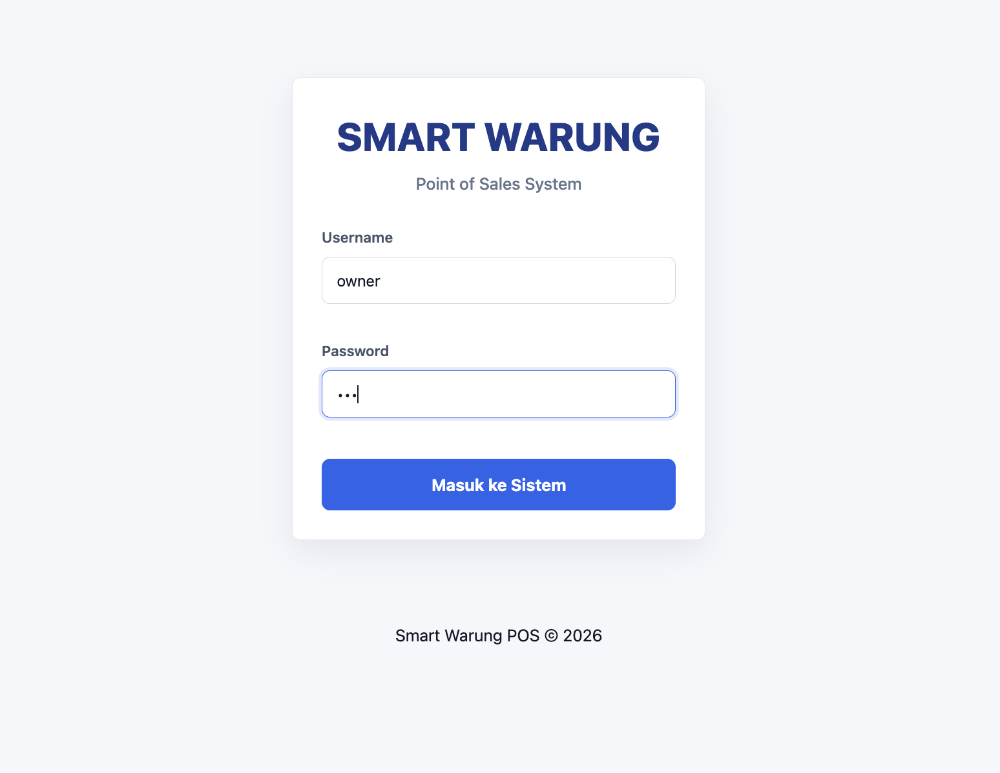
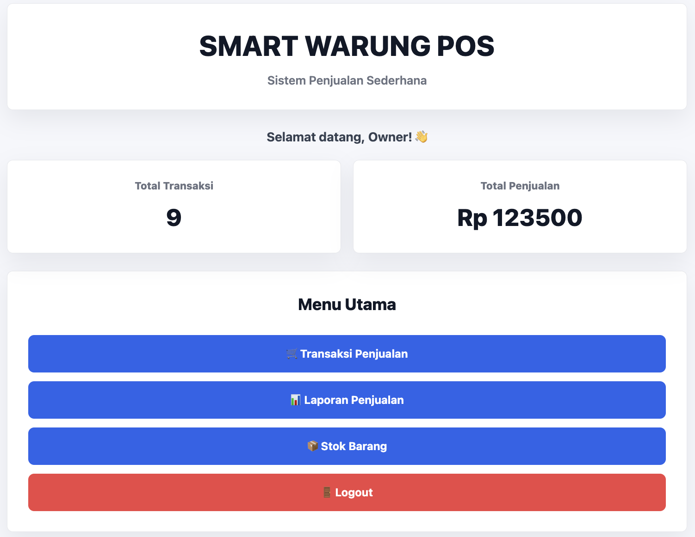
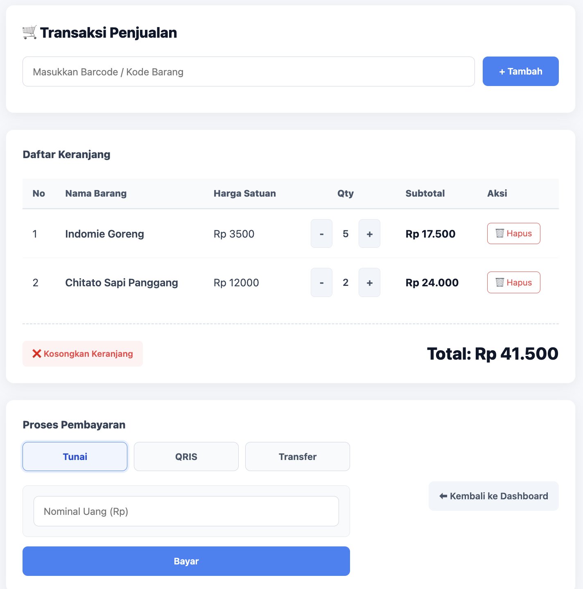
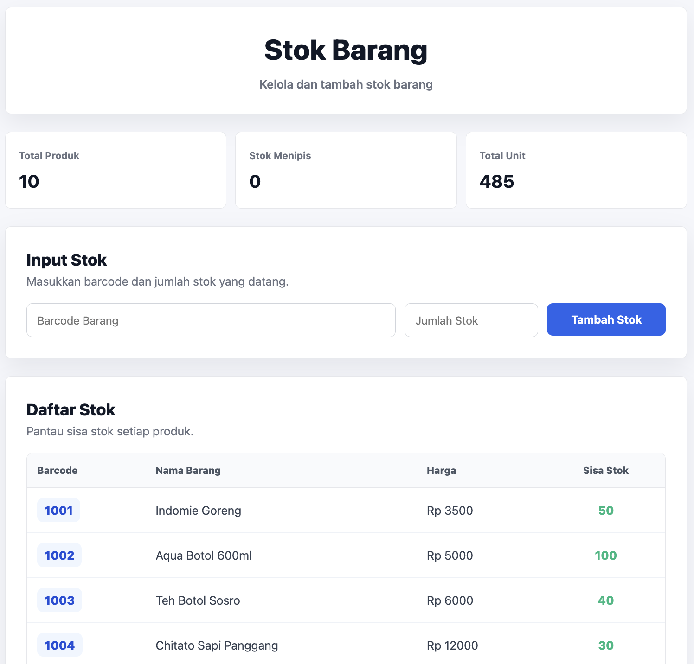
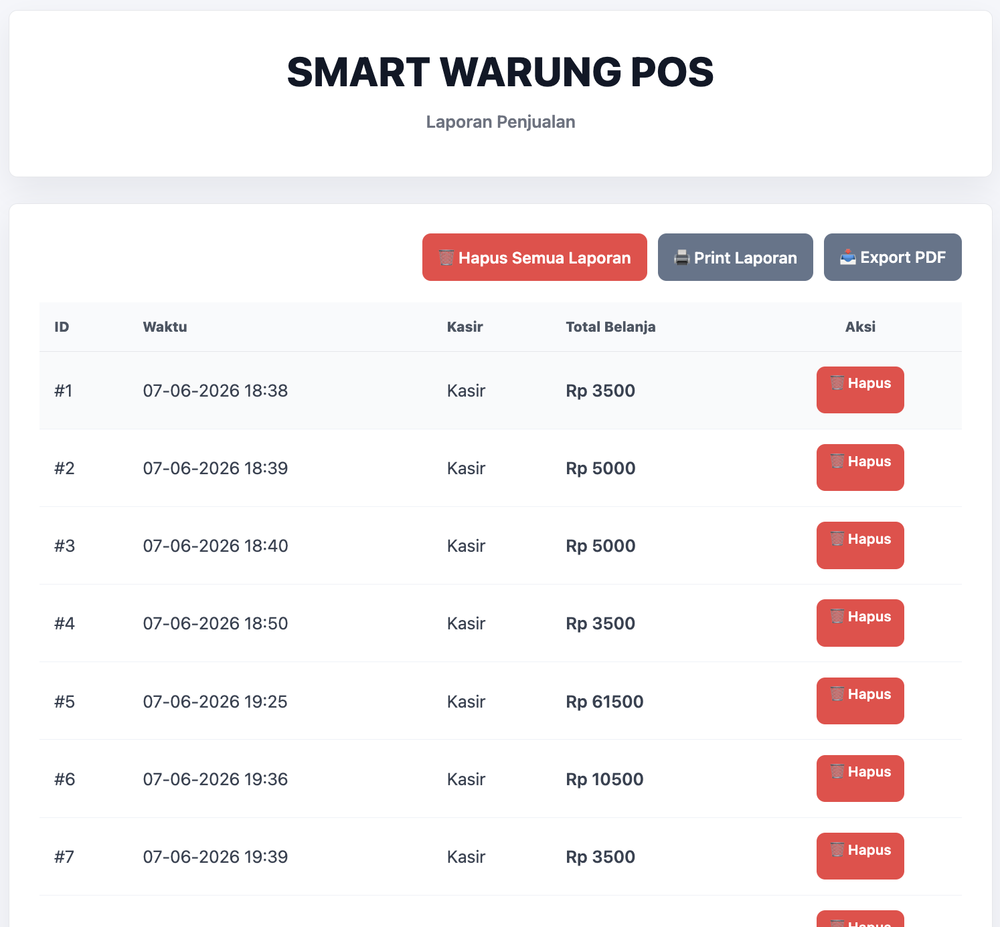
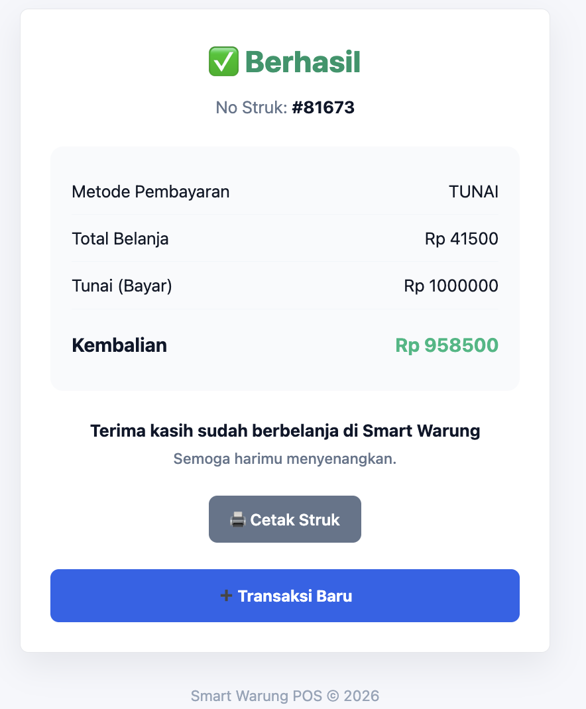

# POS

**Smart Warung POS** adalah aplikasi Kasir (Point of Sale) berbasis web yang ringan, dibangun menggunakan **Flask** dan **SQLite**. Aplikasi ini dirancang untuk memudahkan manajemen transaksi, pemantauan stok barang, dan pelaporan keuangan sederhana bagi UMKM atau warung.

## 📖 Latar Belakang & Skenario

Warung ini menjual kebutuhan sehari-hari seperti makanan ringan, minuman, hingga alat mandi dan cuci piring. Keunikannya terletak pada sistem kasir yang sudah menggunakan pemindaian barcode dan mendukung berbagai metode pembayaran non-tunai. Sistem ini dirancang untuk mempermudah transaksi dan pengelolaan stok. Skenarionya dimulai ketika barang datang; admin akan menginput data barang ke sistem. Saat pelanggan berbelanja, kasir tidak lagi mencari harga secara manual, melainkan cukup melakukan scanning barcode pada produk. Sistem akan otomatis menjumlahkan total belanja. Pada tahap pembayaran, pelanggan diberikan fleksibilitas untuk membayar secara tunai, melalui QRIS, maupun transfer bank. Setelah status pembayaran dikonfirmasi (baik lewat input nominal tunai atau verifikasi mutasi), sistem akan mencetak struk sebagai bukti belanja dan secara otomatis memotong jumlah stok di database secara real-time.
## 📸 Preview Aplikasi

| Halaman Login | Dashboard Utama |
| :---: | :---: |
|  |  |

| Transaksi Penjualan | Manajemen Stok |
| :---: | :---: |
|  |  |

| Laporan & Filter | Struk Pembayaran |
| :---: | :---: |
|  |  |

## 🚀 Fitur Utama

- **Manajemen Transaksi**: Sistem keranjang belanja dengan dukungan input barcode.
- **Multi-Metode Pembayaran**: Mendukung pembayaran Tunai, QRIS, dan Transfer Bank.
- **Manajemen Stok**: Pemantauan stok secara real-time (saat ini berbasis memori/hardcoded).
- **Dashboard Statistik**: Ringkasan jumlah transaksi dan total pendapatan.
- **Laporan & Filter**: Laporan transaksi yang dapat difilter berdasarkan rentang tanggal.
- **Ekspor Data**: Fitur ekspor laporan transaksi ke format **Excel (.xlsx)** menggunakan Pandas.
- **Sistem Otentikasi**: Login untuk Kasir dan Owner (Owner memiliki akses hapus laporan).

## 🛠️ Tech Stack

- **Backend**: Python, Flask
- **Database**: SQLite
- **Data Processing**: Pandas, OpenPyXL (untuk ekspor Excel)
- **Frontend**: HTML5, Modern CSS (Custom UI), JavaScript

## 📋 Prasyarat

Pastikan Anda sudah menginstal Python 3.x di komputer Anda.

## ⚙️ Instalasi

1. **Clone repositori ini atau download source code-nya.**

2. **Buat dan aktifkan Virtual Environment (Disarankan):**
   ```bash
   python -m venv venv
   # Windows:
   venv\Scripts\activate
   # Mac/Linux:
   source venv/bin/activate
   ```

3. **Instal library yang dibutuhkan:**
   ```bash
   python3 -m pip install flask pandas openpyxl
   ```

4. **Inisialisasi Database:**
   Jalankan script berikut untuk membuat file `database.db` dan tabel yang diperlukan:
   ```bash
   python init_db.py
   ```

## 🏃 Cara Menjalankan

Jalankan perintah berikut di terminal:
```bash
python app.py
```
Buka browser dan akses `http://127.0.0.1:5000`.

### 🔑 Akun Default
| Role | Username | Password |
| :--- | :--- | :--- |
| **Kasir** | kasir | 123 |
| **Owner** | owner | 123 |

## 📂 Struktur Proyek

```text
POS/
├── static/              # File statis (CSS, Images, SVG)
├── screenshot/          # Screenshot aplikasi untuk dokumentasi
├── templates/           # Template HTML (Jinja2)
│   ├── login.html
│   ├── dashboard.html
│   ├── transaksi.html
│   ├── stok.html
│   ├── laporan.html
│   └── hasil_bayar.html
├── app.py               # Logika utama aplikasi (Routes & Controller)
├── init_db.py           # Script inisialisasi database SQLite
├── database.db          # Database SQLite (dibuat otomatis)
└── README.md            # Dokumentasi proyek
```

## 📝 Catatan Pengembangan
- Saat ini daftar barang (`BARANG`) masih bersifat *hardcoded* di dalam `app.py`. Untuk pengembangan selanjutnya, disarankan memindahkan data barang ke tabel database agar perubahan stok bersifat permanen.
- Pastikan folder `static` berisi file `qris.svg` atau sesuaikan path gambar di `transaksi.html`.

---
**Smart Warung POS** - *Solusi Digitalisasi Warung Anda.*
